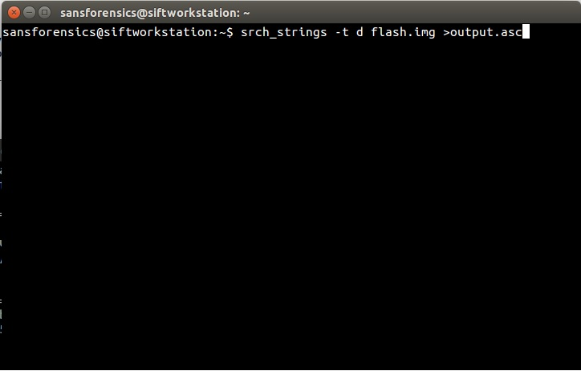
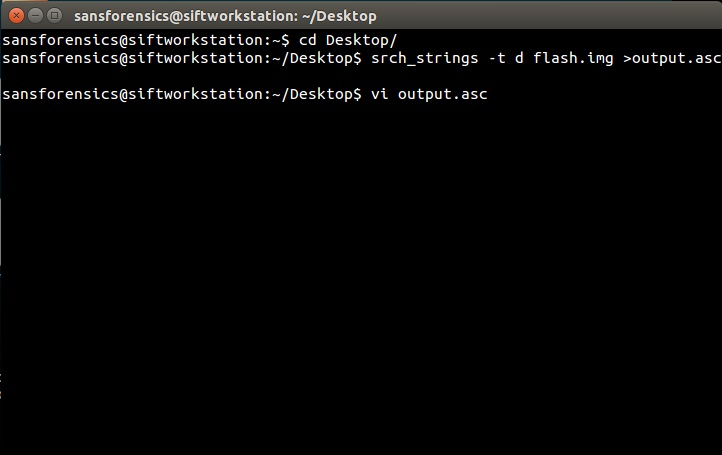
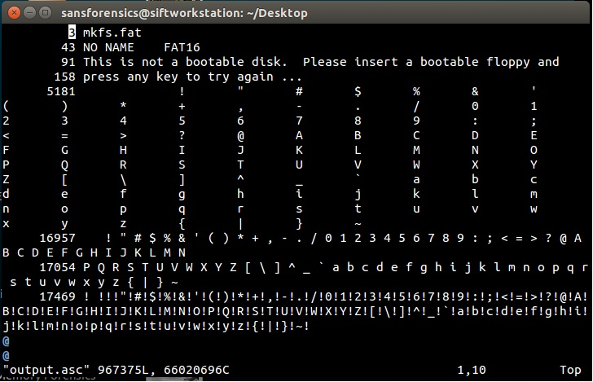
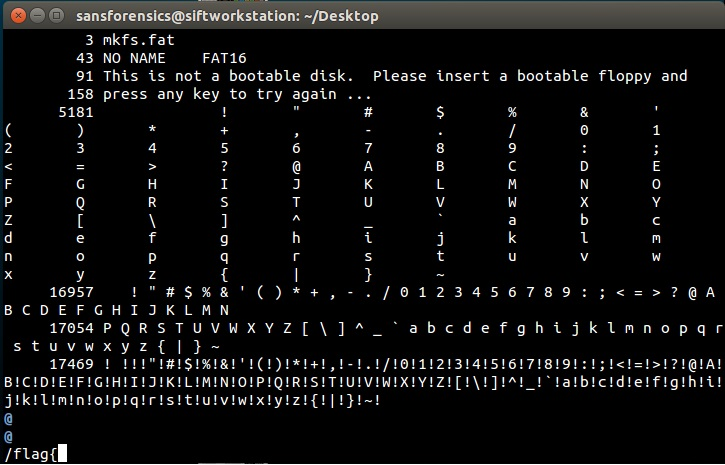
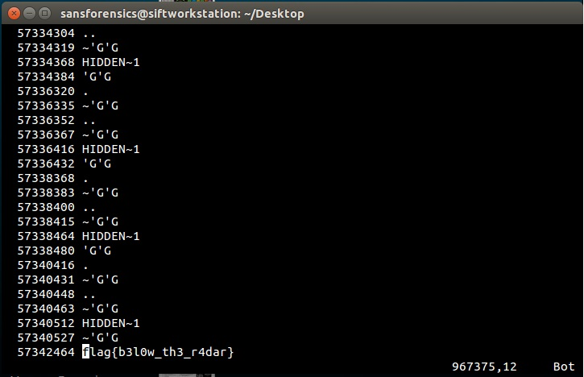

#Flash

**Category:** Forensics 
**Points:** 100 
**Description:** 

We were able to grab an image of a hard drive. Find out what's on it.

##Write-up
Based on the information provided it appears that we will be dealing with an [image](https://en.wikipedia.org/wiki/Disk_image) of a flash hard drive so I am expecting that I will be using forensic software to analyze the file.

My first step was to download the image file and examine it with the [SANS Investigative Forensic Toolkit] (http://digital-forensics.sans.org/community/downloads). The SANS Investigative Forensic Toolkit (SIFT)  is a virtual workstation created for incident response and digital forensics use and made it 

available to the whole community as a public service. 


Open a terminal type the following command ```srch_string -t d flash.img>output.asc ``` for your your image file. 


Now use the vi editor ```vi output.asc``` to open the file output.asc. 


Viewing the file output.asc we see the strings extracted from the image file:


Use the vi command ```/``` to search for the string ```flag{```:


We are able to quickly locate the flag in this image file:


The flag recovered to solve this CTF is ```flag{b3l0w_th3_r4dar}```
