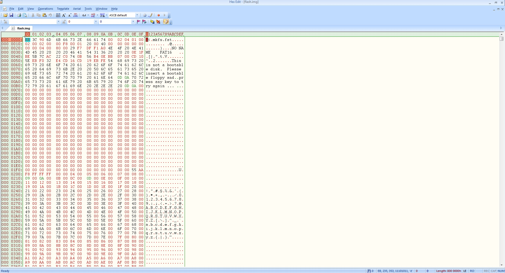
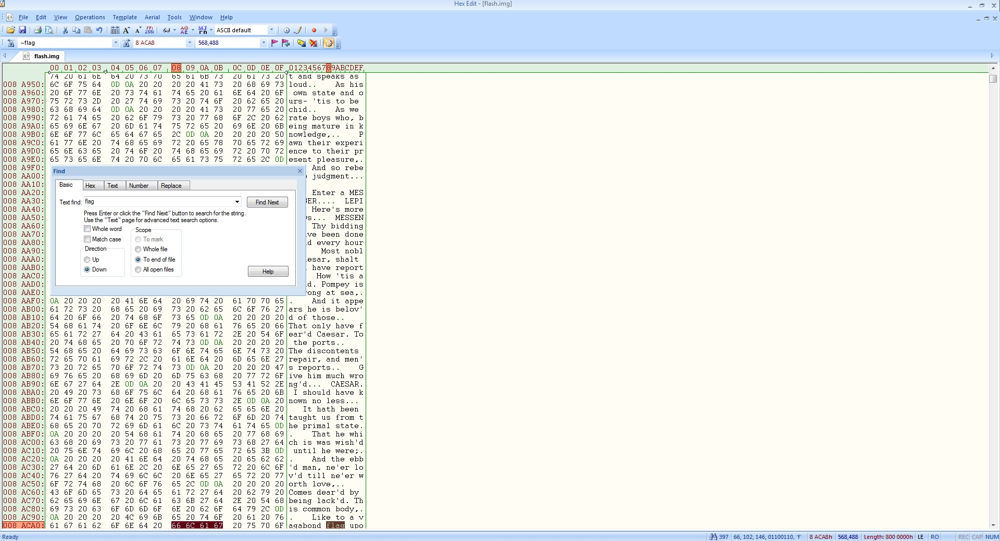
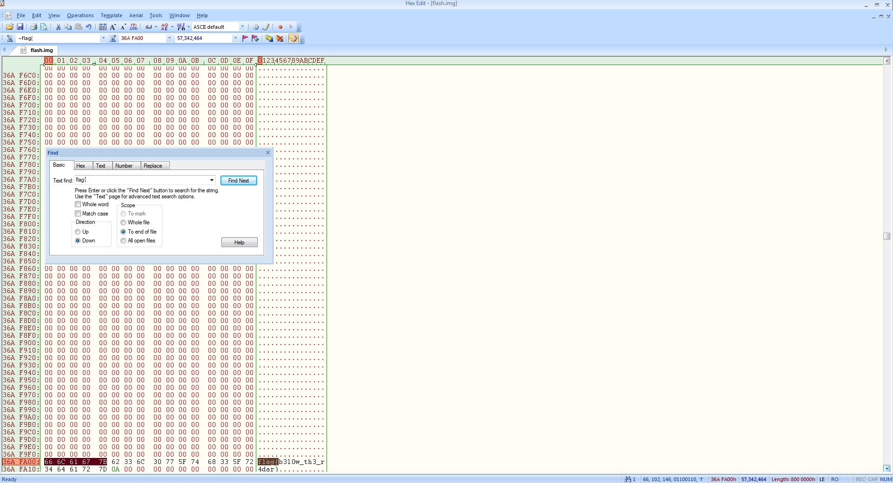

#Flash

**Category:** Forensics 
**Points:** 100 
**Description:** 

We were able to grab an image of a harddrive. Find out what's on it.

##Write-up

Based on the information provided it appears that we will be dealing with an [image](https://en.wikipedia.org/wiki/Disk_image) of a flash hard drive so I am expecting that I will be using forensic software to analyze the file.

I never know how well data is going to be hidden in a file so I open this file with [Hex Edit](http://www.hexedit.com) and take a quick look. 
]

I perform a simple search for the term ```flag``` and I get numerous hits.
]

So to reduce the scope of the search I change the search term to ```flag{``` and I am immediately taken to the flag for this CTF ```flag{b3l0w_th3_r4dar}```
]

The flag recovered to solve this CTF is ```flag{b3l0w_th3_r4dar}```
