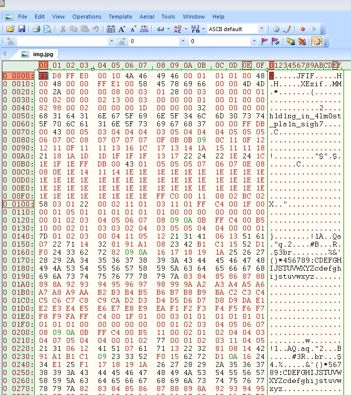

#Keep Calm and CTF

**Category:** Forensics 
**Points:** 100 
**Description:** 

My friend sends me pictures before every ctf. He told me this one was special.
Note: this flag doesn't follow the "flag{}" format

##Write-up
Our first clues come from the actual CTF description. The CTF description identifies this file as a possible image file and states this image is special. This caused me to immediately start thinking this CTF would be related to steganography ([Steganography](https://en.wikipedia.org/wiki/Steganography) is the practice of concealing data within another file). The CTF description also states that the flag does not follow the "flag{}" format so I will need to keep an open mind when searching for the flag and not focus on the word 'flag' per se. 

At first glance the file appears to be a normal image file. It displays properly in an image viewer and there are no error messages present when trying to open the file. 

]

In cases where I suspect steganography what I usually do is first is open the file with a hex editor to see if anything obviously jumps out at me as hidden data. 


So I open the file with [Hex Edit](www.hexedit.com) and take a quick look. 
]

Scrolling thru the file I can quickly see there appears to be a message hidden at the top of the file.

]

Entering the value ```h1d1ng_in_4lm0st_pla1n_sigh7``` as the flag solves this challenge.
