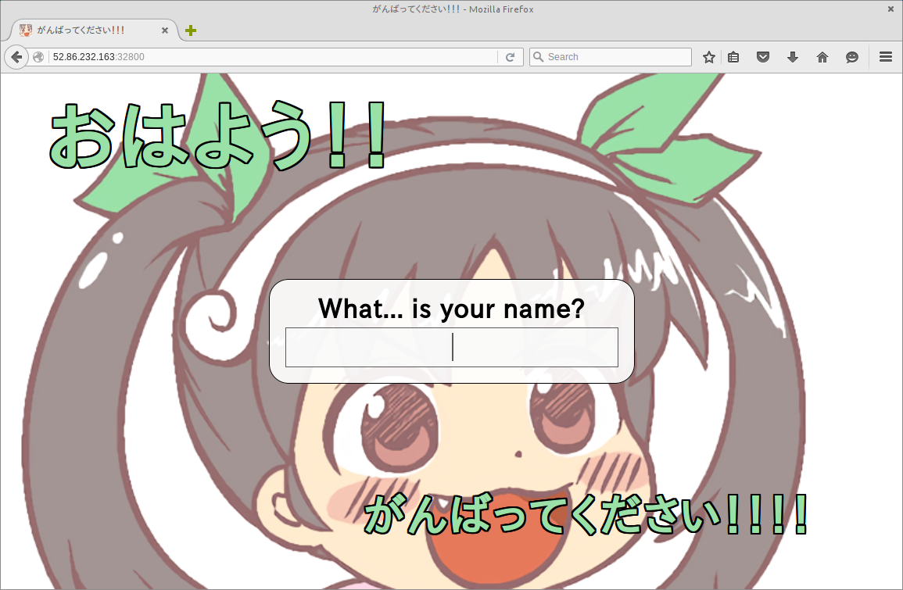
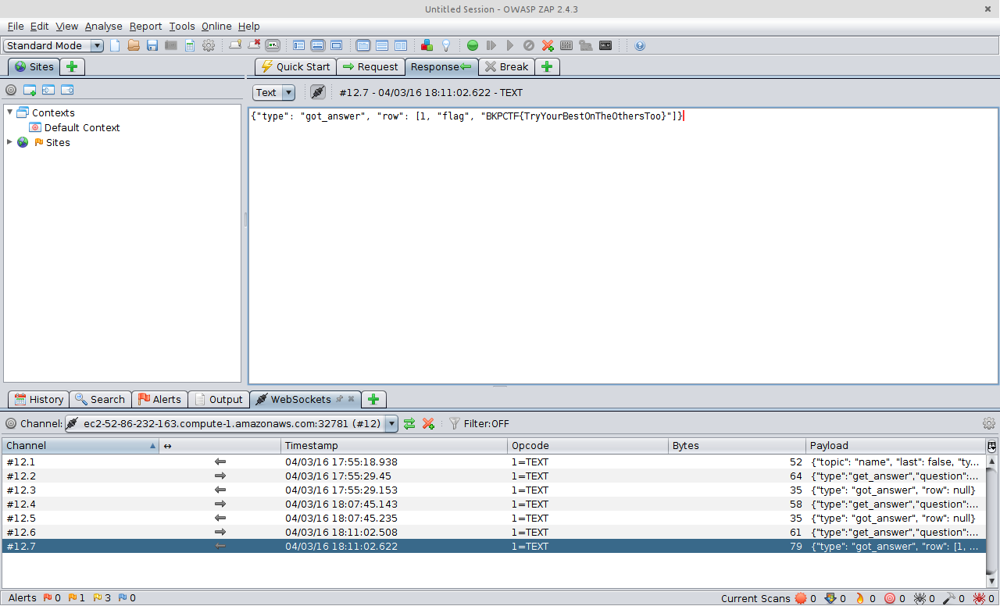

#Good Morning

**Category:** Web
**Points:** 3
**Description:**

https://s3.amazonaws.com/bostonkeyparty/2016/bffb53340f566aef7c4169d6b74bbe01be56ad18.tgz

##Write-up
An initial visit to the site provided a familiar question set from the movie ```Monty Python and the Holy Grail```.  They were:
  * What is your name?
  * What is your quest?
  * What is your favourite color?



The Japanese theme also stands out throughout the site.

A quick look at the [source code](./release) reveals a ```websocket``` that communicates through ```json``` requests.

```python
def process_questsions(ws):
  i = 0
  conn = MySQLdb.connect(**connect_params)
  with conn as cursor:
    ws.send(json.dumps({"type": "question", "topic": questions[i], "last": i == len(questions)-1}))
    while not ws.closed:
      message = ws.receive()
      if not message: continue
      message = json.loads(message)
      if message["type"] == "answer":
        question = mysql_escape(questions[i])
        answer = mysql_escape(message["answer"])
        cursor.execute('INSERT INTO answers (question, answer) VALUES ("%s", "%s")' % (question, answer))
        conn.commit()
        i += 1
        if i < len(questions):
          ws.send(json.dumps({"type": "question", "topic": questions[i], "last": i == len(questions)-1}))
      elif message["type"] == "get_answer":
        question = mysql_escape(message["question"])
        answer = mysql_escape(message["answer"])
        cursor.execute('SELECT * FROM answers WHERE question="%s" AND answer="%s"' % (question, answer))
        ws.send(json.dumps({"type": "got_answer", "row": cursor.fetchone()}))
      print message
```

```javascript
$("#prompt-input input").keyup(function(event) {
    if (event.keyCode != 13) { return; } // enter
    var answer = $(this).val();
    socket.send(JSON.stringify({"type": "answer", "answer": answer }));
    if (last) {
      socket.send(JSON.stringify({"type": "get_answer", "question": question, "answer": answer}));
    }
  });
```

After the initial question sequence there was a ```get_answer``` request that was followed by a ```got_answer``` response.  This ```get_answer``` request effectively let you query the database with the following query:

```sql
SELECT * FROM answers WHERE question="%s" AND answer="%s
```

It seemed obvious from this that we need to bypass the ```WHERE``` clause with a SQLi to dump the database and the flag itself.  However, it is also important to note that there was an escape routine present that thwarted our best efforts for standard SQLi style attacks.

```python
MYSQL_SPECIAL_CHARS = [
  ("\\", "\\\\"),
  ("\0", "\\0"),
  ("\n", "\\n"),
  ("\r", "\\r"),
  ("'", "\\'"),
  ('"', '\\"'),
  ("\x1a", "\\Z"),
]
def mysql_escape(s):
  for find, replace in  MYSQL_SPECIAL_CHARS:
    s = s.replace(find, replace)
  return s
```

A lot of time was spent trying to bypass these filters until a team member pointed out the charset being directly set in the code.

```python
Response.charset = "shift-jis"
connect_params["charset"] = "sjis"
```

A quick research of the charset revealed that it should be succeptible to a SQLi through a multibyte character.  The multibyte attack works when a multibyte character is split into two separate bytes (because of a mismatch of character sets) and is used to manipulate the backend values. In this case, we needed a way to escape a double quote in order to successfully inject into the query.  I spent hours trying different characters like ```葜``` to no avail.  The thought was that by injecting ```葜\" or 1=1#``` it would split the Japanese character and the last byte of that character would turn into another ```\``` leaving us effectively with ```\\" or 1=1#```.  The idea was actually spot on, but unfortunately we didn't find the correct character in time.  It turns out we were focusing on the more complex characters when ￥ (0x005c) would have done the job.  The injection would then be ```￥\" or 1=1#``` which again would be translated into ```\\" or 1=1#```.  This injection actually was quite nice, we were able to escape the original double quote as to not screw up our ```json``` request, but on the backend, our ```\``` was escaped with another ```\``` that manifested out of the multibyte character.  In the end the request did in fact spit out the flag as it was the first record in the database.


