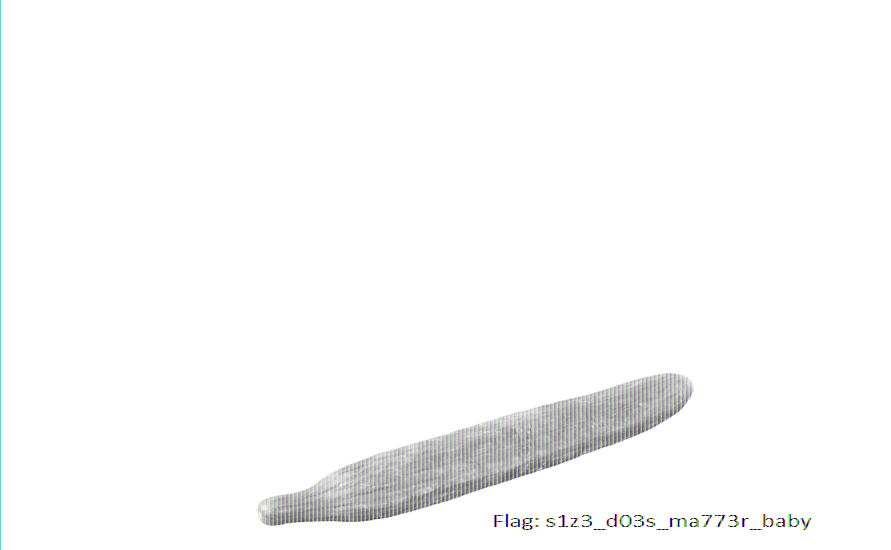
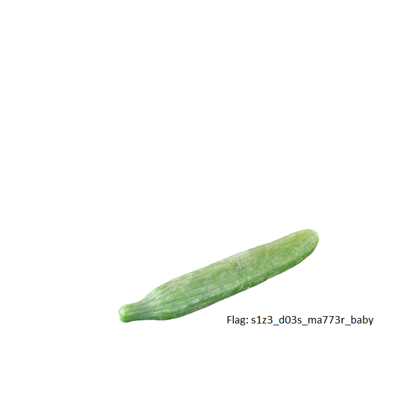

#She said it doesn't matter

**Category:** Misc
**Points:** 100
**Description:**

N/A

##Write-up

We are given an image ([m100.png](./Images/m100.png)) that initially won't open.  A quick run through ```pngcheck``` shows the following:

```
# pngcheck m100.png 
m100.png  CRC error in chunk IHDR (computed 3ff4fc62, expected 35468913)
ERROR: m100.png
```

Ok, that's easy enough to fix.  Let's grab [pngcsum](http://schaik.com/png/pngcsum.html) and generate a new file.

```
# ~/pngcsum m100.png m101.png 
IHDR ( 13 ) - csum = 35468913 -> 3ff4fc62
gAMA (  4 ) - csum = 0bfc6105
pHYs (  9 ) - csum = 952b0e1b
tEXt ( 25 ) - csum = 71c9653c
IDAT (65010 ) - csum = 629a9431
IEND (  0 ) - csum = ae426082
```

This gives us a valid png file, which reveals the following image.


Since size matters, per the name of the challenge, let's start messing with the dimensions of this file.  Per the [PNG specifications](http://www.w3.org/TR/PNG/#11IHDR), the width and height should be the 8 bytes after the ```IHDR``` header.  Opening up the file with ```hexeditor``` reveals the header and current dimensions.

```
File: m101.png                    ASCII Offset: 0x00000000 / 0x0000FE74 (%00)  
00000000  89 50 4E 47  0D 0A 1A 0A   00 00 00 0D  49 48 44 52   .PNG........IHDR
00000010  00 00 02 9A  00 00 02 07   08 06 00 00  00 3F F4 FC   .............?..
00000020  62 00 00 00  04 67 41 4D   41 00 00 B1  8F 0B FC 61   b....gAMA......a
00000030  05 00 00 00  09 70 48 59   73 00 00 0E  C4 00 00 0E   .....pHYs.......
00000040  C4 01 95 2B  0E 1B 00 00   00 19 74 45  58 74 53 6F   ...+......tEXtSo
00000050  66 74 77 61  72 65 00 41   64 6F 62 65  20 49 6D 61   ftware.Adobe Ima
00000060  67 65 52 65  61 64 79 71   C9 65 3C 00  00 FD F2 49   geReadyq.e<....I
00000070  44 41 54 78  5E EC FD E5   97 6B E7 BD  E6 FD 9E FF   DATx^....k......
00000080  E8 39 FD 74  EF DE 3B 7B   87 9D 6C 3B  8E 63 C7 BC   .9.t..;{..l;.c..
00000090  18 8A 99 99  59 05 2A 61   49 C5 4C 62  66 28 66 58   ....Y.*aI.Lbf(fX
000000A0  4C C6 C4 61  D8 61 C7 4E   76 E0 3A BF  39 B3 5E 9C   L..a.a.Nv.:.9.^.
000000B0  71 46 9F D1  FD 74 7B 06   AF 8F C7 1C  52 A9 A4 A9   qF...t{.....R...
000000C0  29 AD 7A F1  B5 A6 EE FB   FE 7F 81 88  88 88 88 48   ).z............H
000000D0  43 0C 4E 22  22 22 22 D2   14 83 93 88  88 88 88 34   C.N""""........4
000000E0  C5 E0 24 22  22 22 22 4D   31 38 89 88  88 88 48 53   ..$""""M18....HS
000000F0  0C 4E 22 22  22 22 D2 14   83 93 88 88  88 88 34 C5   .N""""........4.
00000100  E0 24 22 22  22 22 4D 31   38 89 88 88  88 48 53 0C   .$""""M18....HS.
00000110  4E 22 22 22  22 D2 14 83   93 88 88 88  88 34 C5 E0   N""""........4..
00000120  24 22 22 22  22 4D 31 38   89 88 88 88  48 53 0C 4E   $""""M18....HS.N
00000130  22 22 22 22  D2 14 83 93   88 88 88 88  34 C5 E0 24   """"........4..$
00000140  22 22 22 22  4D 31 38 89   88 88 88 48  53 0C 4E 22   """"M18....HS.N"
00000150  22 22 22 D2  14 83 93 88   88 88 88 34  C5 E0 24 22   """........4..$"
```

We can focus in on the following values:

```
00 00 02 9A  00 00 02 07
```

The current values make a ```666 x 519``` image.  We can edit the height and make a square image to start.  The values should change to:

```
00 00 02 9A  00 00 02 9A
```

Changing the file messes up our CRC again, so we need to rerun the new file through [pngcsum](http://schaik.com/png/pngcsum.html) and we are given our new image.

```
# ~/pngcsum m101.png m102.png
IHDR ( 13 ) - csum = 3ff4fc62 -> 9e0cf9ff
gAMA (  4 ) - csum = 0bfc6105
pHYs (  9 ) - csum = 952b0e1b
tEXt ( 25 ) - csum = 71c9653c
IDAT (65010 ) - csum = 629a9431
IEND (  0 ) - csum = ae426082
```


At this point the flag is visible ```s1z3_d03s_ma773r_baby```, but pretty hard to read.  We can stop here, but there was an intriguiging writeup by [p4](https://github.com/p4-team/ctf/tree/master/2015-10-02-dctf/misc_100_doesnt_matter) that I wanted to explore.  After a quick read of their writeup and some referencing back to the [PNG specifications](http://www.w3.org/TR/PNG) I decided that I wanted to try and duplicate the results using python to pull back the raw pixel data out of the png and redisplaying it with [PIL](http://pillow.readthedocs.org/en/3.0.x/handbook/overview.html).  However, the [p4](https://github.com/p4-team/ctf/tree/master/2015-10-02-dctf/misc_100_doesnt_matter) writeup jumps past a lot of data so I was left with a lot of reading and setup before I could attempt any python.  

To start, let's talk about how pixels are stored within a PNG. A quick read of documentation, or google searching, will reveal that the pixels are stored in the [IDAT](http://www.w3.org/TR/PNG/#11IDAT) section of the file, and further reading will show that this data is [compressed](http://www.w3.org/TR/PNG/#10Compression) with (most likely) zlib.  If we glance back up to the ```hexeditor``` data we can see the the ```IDAT``` header is immediately follow by ```78 5E``` with the ```78``` standing out as as a common [magic number](https://en.wikipedia.org/wiki/Magic_number_(programming)) for the first byte of a ```zlib``` header.

```
00000060  67 65 52 65  61 64 79 71   C9 65 3C 00  00 FD F2 49   geReadyq.e<....I
00000070  44 41 54 78  5E EC FD E5   97 6B E7 BD  E6 FD 9E FF   DATx^....k......
```

This means we should be able to extract the ```zlib``` compressed data and decompress it with python, which would leave us with the raw image data.  To isolate the compressed data I used ```pngsplit``` to seperate the different sections of the file.

```
# pngsplit m102.png 
pngsplit, version 0.60 BETA of 11 February 2007, by Greg Roelofs.
  This software is licensed under the GNU General Public License.
  There is NO warranty.

m102.png:
# ls
m100.png  m102.png.0000.sig   m102.png.0003.pHYs  m102.png.0006.IEND
m101.png  m102.png.0001.IHDR  m102.png.0004.tEXt
m102.png  m102.png.0002.gAMA  m102.png.0005.IDAT
```

Now that we we have the ```IDAT``` section isolated we need to ensure that we strip off the fluff at the begining and start directly with the ```zlib``` header.  Looking at the begining of the file we see:

```
 00 00 FD F2  49 44 41 54   78 5E EC FD  E5 97 6B E7
```

Therefore we need to delete the first 8 bytes of this file which can be done with the edior of your choice.  You should be left with a file similiar to [m102.png.0005.IDAT](./Images/m102.png.0005.IDAT).  Once we have the ```zlib``` compressed data we can finally put python to use.

We can decompress the data with:

```python
raw = open('m102.png.0005.IDAT','rb').read()
data = zlib.decompress(raw)
```

and then configure and save the raw data with:

```python
im = Image.frombytes('RGB',(891,550),data)
im.save('flag.png')
```

To get the correct ```mode``` and ```size``` for the ```Image.frombytes``` call takes some brute forcing, but in the end you should land on an image similiar to this.



The full script used was:

```python
import zlib
from PIL import Image

raw = open('m102.png.0005.IDAT','rb').read()
data = zlib.decompress(raw)
im = Image.frombytes('RGB',(891,550),data)
im.save('flag.png')
```

Why stop here though?  There is more fun to be had.  Now that we actually have the correct image, we still want to see it in it's full color.  Turning back to our original method of just editing the ```IHDR``` header we end up running across a ```668 x 668``` dimension which yields:



In the end, all we needed to do was find the correct dimension with the ```IHDR``` header, but I saw some value in being able to pull the raw data out of the image and do our brute forcing within the python script (hopefully it will help us in future challenges).
