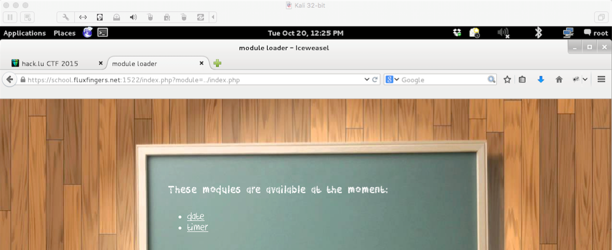
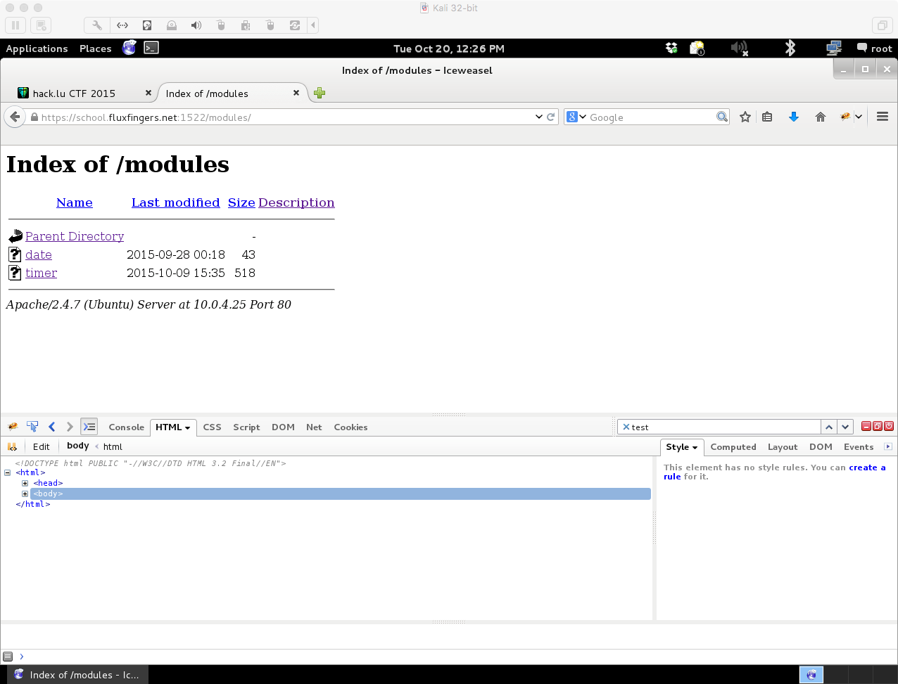
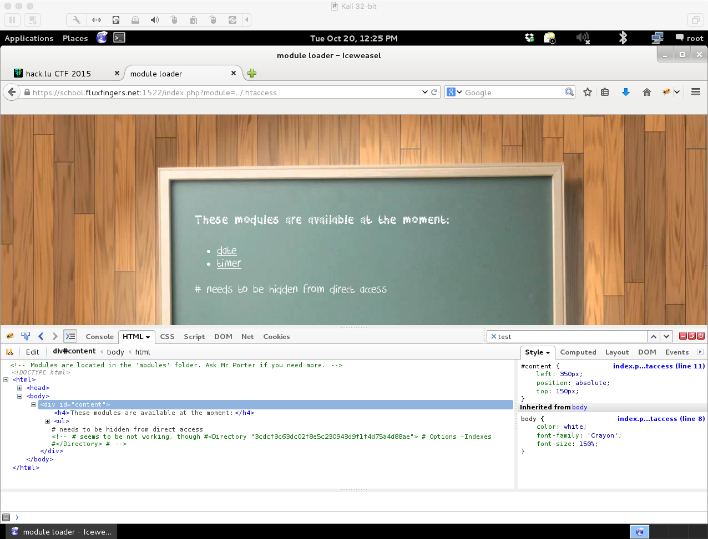
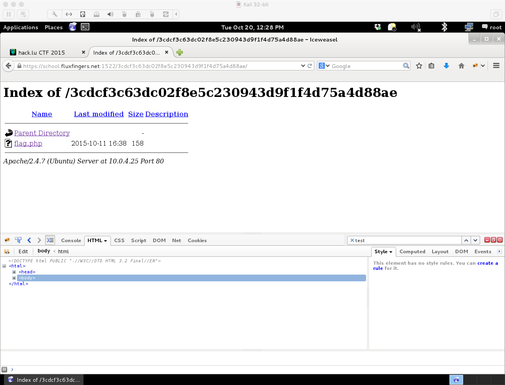
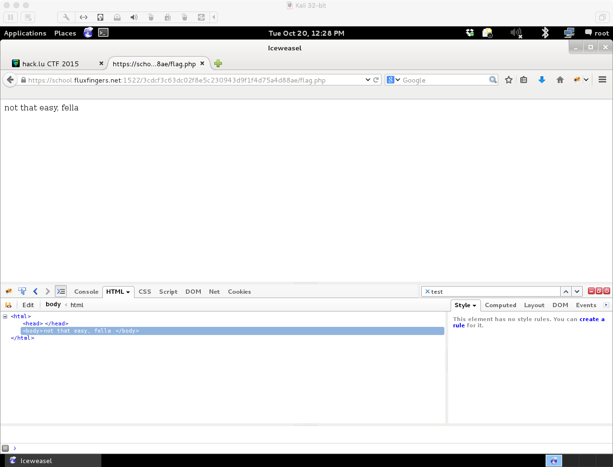
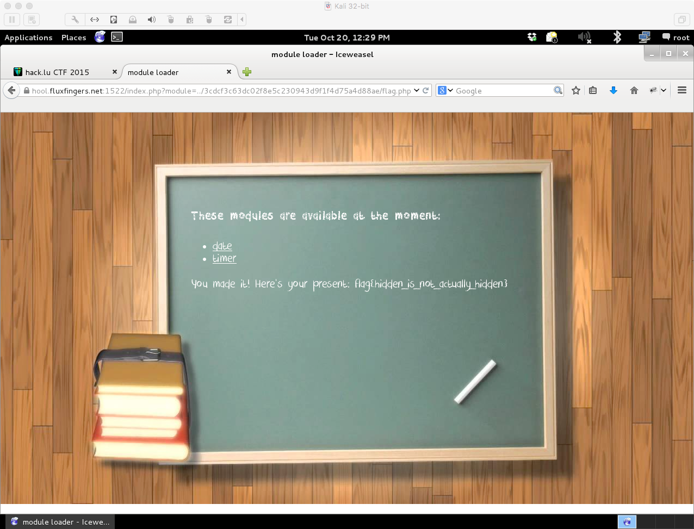

#Module Loader

**Category:** Web
**Points:** 100
**Description:**

Since his students never know what date it is and how much time they have until the next homework's deadline, Mr P. H. Porter wrote a little webapp for that.

https://school.fluxfingers.net:1522/

##Write-up

We are presented with a site that has two links, one to get the current date and one to calculate time based off of a parameter.



Viewing the source reveals a comment at the top that tells us that all of the modules are in the modules directory.  Going there reveals:



This gives us the php code for the two pages. Since we know the modules are one level up and they are php, let's go back and try to include index.php itself in the main page.


Ok, we are looking at a basic local file inclusion.  Let's see what other files we can find.



.htaccess returns something different.  Looking at the source there is a directory with indexing turned on.  Let's see if we can get there.



Ah, ```flag.php```.  Let's see what it is.



Well, not quite what we wanted.  Let's go back to the main page and include ```flag.php``` with its path as the module.



```flag{hidden_is_not_actually_hidden}```
